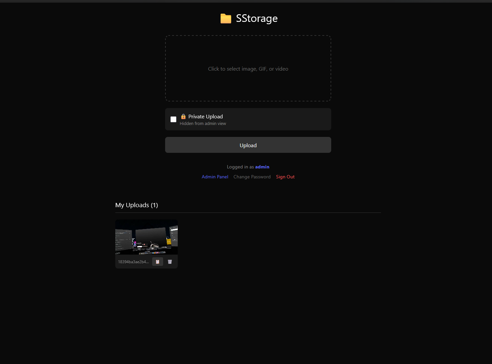
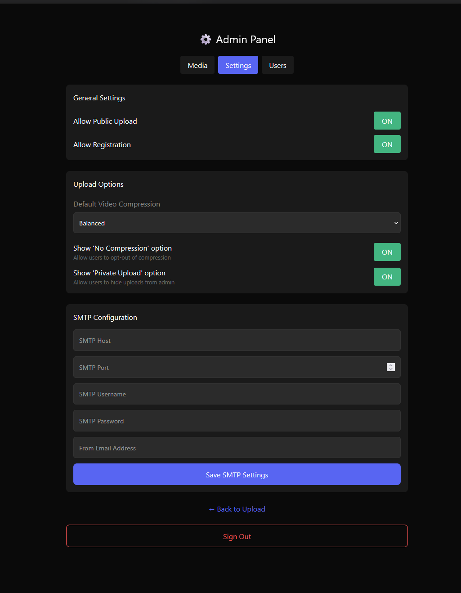

# SStorage

A self-hosted media storage and sharing application developed with Next.js. Supports image and video uploads with built-in transcoding, user management, and privacy controls.

## Features

### Core Functionality
- **File Uploads**: Supports images and videos with drag-and-drop interface.
- **Video Processing**: Automatic transcoding using FFmpeg.
- **Compression**: Configurable video compression levels (Original, High, Balanced, Small).
- **Direct access**: Files are served directly (e.g., for embedding in Discord).

### User System
- **Accounts**: User registration and login.
- **My Uploads**: Users can manage their own uploaded files.
- **Privacy**: Option to mark uploads as private (hidden from admin view).

### Admin Panel
- **Dashboard**: View system stats and recent uploads.
- **File Management**: View and delete any user's files (unless private).
- **User Management**: Create, edit, and delete users. Set custom storage limits per user.
- **Configuration**:
  - Toggle public uploads and user registration.
  - Set global file size limits.
  - Configure SMTP for emails.
  - Set default compression rules.
  - "Force Private" mode to hide all user uploads from admins by default.

## Deployment with Docker Compose

This repository includes a `docker-compose.yml` file configured to use the pre-built image. Then you can just run `docker-compose up -d` and it runs at port 3000 by default.

### Default Login
On first launch, an admin account is created automatically:
- **Username**: `admin`
- **Password**: `admin123`

You will be required to change this password immediately upon logging in.

## Configuration

All configuration is managed through the web interface in the Admin Panel settings page. Settings are persisted in the database.